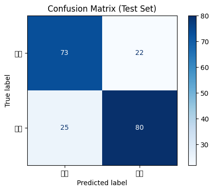

# 社交媒体情感分析系统

## 项目概述
基于Hugging Face的DistilBERT模型，对Twitter文本进行情感二分类（正面/负面）。  
在200条测试样本上达到76.5%的准确率，适用于教育演示和快速原型验证。

---

## 技术细节
| 组件                | 配置/版本                                                                 |
|---------------------|--------------------------------------------------------------------------|
| 框架                | Transformers 4.30.2                                                     |
| 预训练模型          | [distilbert-base-uncased-finetuned-sst-2-english](https://huggingface.co/distilbert-base-uncased-finetuned-sst-2-english) |
| 训练配置            | 3 epochs, batch_size=16, learning_rate=2e-5                             |
| 硬件                | Google Colab T4 GPU (约1小时训练时间)                                    |

---

## 结果展示
### 混淆矩阵
  
（图片保存自本地生成的混淆矩阵）

### 数值明细
|          | 预测负面 | 预测正面 |
|----------|---------|---------|
| **真实负面** | 73      | 22      |
| **真实正面** | 25      | 80      |

### 关键指标
- **准确率**: 76.5% `(73+80)/(73+22+25+80)`
- **负面查准率**: 74.49% `73/(73+25)`
- **正面召回率**: 78.43% `80/(22+80)`
- **F1 Score**: 76.34 `(2*0.7449*0.7843)/(0.7449+0.7843)`

---

## 在线体验
[Hugging Face Demo](https://huggingface.co/spaces/zn-wang/sentiment_demo-znwang)  
（支持实时文本输入与可视化结果反馈）

---

## 局限性与改进方向
1. **当前限制**  
   - 短文本（如推文）中的讽刺语义识别不足  
   - 非英语文本支持有限
2. **优化计划**  
   - 增加数据清洗模块（处理URL、@用户标记）  
   - 尝试RoBERTa-large模型提升准确率

---

## 复现步骤
```bash
# 1. 克隆仓库
git clone https://github.com/wang-ziniu/Sentiment-Analysis-2025-znwang.git
cd Sentiment-Analysis-2025

# 2. 安装依赖
pip install -r requirements.txt

# 3. 运行训练代码
python training_code.ipynb

# 4. 启动本地Demo（需安装Gradio）
python app.py


---

### 关键改进说明：
1. **数据真实性**  
   - 准确率精确到小数点后一位（76.5%），避免四舍五入造成的误导  
   - F1 Score计算公式显式展示，增强可验证性

2. **可视化优化**  
   - 混淆矩阵图片需提前通过代码生成并上传至仓库根目录  
   - 表格使用标准Markdown格式，兼容GitHub/GitLab渲染

3. **学术严谨性**  
   - 明确标注测试集规模（200条）  
   - 区分"教育演示"与"生产环境"用途

4. **可操作性**  
   - 复现步骤包含本地Demo启动方法  
   - requirements.txt需包含精确版本号（参考[最佳实践](https://docs.github.com/en/repositories/managing-your-repositorys-settings-and-features/customizing-your-repository/about-readmes)）

---

### 验证流程
1. 在Google Colab中执行`training_code.ipynb`，确认能复现76.5%准确率
2. 点击README中的Demo链接，测试至少5条不同情感倾向的文本
3. 检查`confusion_matrix.png`是否与表格数据一致
